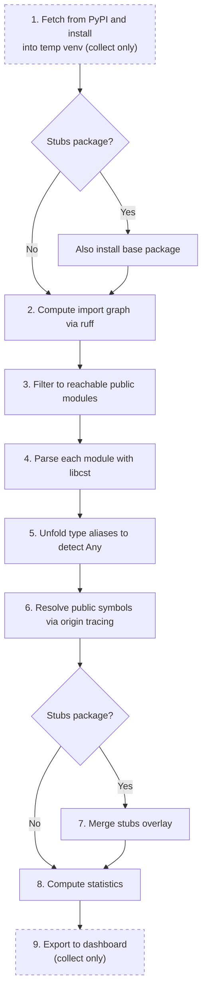

<!-- This file has moved to docs/reference/implementation.md -- delete this file. -->

The analysis pipeline is shared between two commands:

- `typestats check`: analyzes a package already installed in the current environment.
  Runs steps 2--8 below.
- `typestats collect`: fetches packages from PyPI into a temporary venv and exports results
  for the dashboard. Runs all steps (1--9). Not intended for direct use by end-users.

For a given project:

1. **Fetch** (`collect` only): query PyPI for the latest version, install the package (and any
   companion stub package) into a temporary venv via `uv pip install --no-deps`.
   `check` skips this step and uses the package as installed in the current environment.
2. **Graph**: compute the import graph using `ruff analyze graph`.
3. **Filter**: keep only files transitively reachable from public modules (skip tests, tools,
   etc.).
4. **Parse**: use `libcst` to extract all typable symbols, their annotations, exports, imports,
   type aliases, and overloads from each reachable file.
5. **Unfold**: resolve type aliases to detect `Any` annotations (direct usage, local aliases like
   `type Unknown = Any`, and cross-module alias chains).
6. **Resolve**: trace public symbols via re-export chains back to their defining module.
   When merging stubs, both packages use public-name mode (no origin tracing) so FQNs match
   directly.
7. **Merge stubs**: when the input is a stubs package (`{project}-stubs` or `types-{project}`),
   overlay its `.pyi` types onto the base package per-module.
8. **Measure**: compute coverage and other statistics.
9. **Export** (`collect` only): output the results for the dashboard.
   `check` prints coverage to stdout instead.

## Symbol collection

### Per-module (via libcst)

- **Imports**: `import m`, `import m as a`, `from m import x`, `from m import x as a`
- **Wildcard imports**: `from m import *`
- **Explicit exports**: `__all__ = [...]` (list, tuple, or set literals)
- **Dynamic exports**: `__all__ += other.__all__`
  ([spec](https://typing.python.org/en/latest/spec/distributing.html#library-interface-public-and-private-symbols))
- **Implicit re-exports**: `from m import x as x`, `import m as m`
  ([spec](https://typing.python.org/en/latest/spec/distributing.html#import-conventions))
- **Type aliases**: `X: TypeAlias = ...`, `type X = ...`, `X = TypeAliasType("X", ...)`
- **Name aliases**: `X = Y` where `Y` is a local symbol (viz. type alias) or an imported name
  (viz. import alias)
- **Special typeforms** (excluded from symbols): `TypeVar`, `ParamSpec`, `TypeVarTuple`, `NewType`,
  `TypedDict`, `namedtuple`
- **Typed variables**: `x: T` and `x: T = ...`
- **Functions/methods**: full parameter signatures with `self`/`cls` inference
- **Overloaded functions**: `@overload` signatures collected and merged
- **Method aliases**: `__radd__ = __add__` inherits the full function signature
- **Properties**: `@property` / `@cached_property` with `@name.setter` and `@name.deleter`
  accessors; `fget` return type and `fset` parameters contribute to coverage (`fdel` is excluded)
- **Classes**: typed only when *all* members (attributes, methods, properties) are typed;
  protocols are excluded from coverage
- **Class-body attributes**: annotated and unannotated assignments collected as class members
- **Instance attributes**: `self.x` assignments in `__init__`/`__new__`/`__post_init__` collected
  as class members; private (`_`-prefixed) attributes excluded; inherited typed attributes not
  re-collected in subclasses
- **`__slots__` exclusion**: `__slots__` assignments are ignored
- **Enum members**: auto-detected as `IMPLICIT` (via `Enum`/`IntEnum`/`StrEnum`/`Flag`/... bases)
- **Dataclass / NamedTuple / TypedDict fields**: auto-detected as `IMPLICIT` (typed by definition)
- **Type-ignore comments**: `# type: ignore[...]`, `# pyrefly:ignore[...]`, etc.
- **`Annotated` unwrapping**: `Annotated[T, ...]` --> `T`
  ([spec](https://typing.python.org/en/latest/spec/qualifiers.html#annotated))
- **Aliased typing imports**: `import typing as t` resolved via a lightweight import map
  (built incrementally during the single-pass `libcst` visitor), avoiding the expensive
  `QualifiedNameProvider` / `ScopeProvider` pipeline
- **`Any` detection**: annotations that resolve to `typing.Any` (or `typing_extensions.Any`,
  `_typeshed.Incomplete`, `_typeshed.MaybeNone`, `_typeshed.sentinel`,
  `_typeshed.AnnotationForm`)--whether used directly, through local type aliases
  (`type Unknown = Any`), or cross-module alias chains--are marked `ANY` and tracked separately,
  but still count as typed for coverage purposes

### Cross-module (via import graph)

- **Import graph**: `ruff analyze graph` with `--type-checking-imports` (TYPE_CHECKING
  imports are always included)
- **Reachability filtering**: only files transitively reachable from public modules are parsed,
  skipping tests, benchmarks, and internal tooling
- **Excluded directories and files**: the following directories are automatically excluded from
  analysis: `.spin`, `_examples`, `benchmarks`, `doc`, `docs`, `examples`, `tests`.
